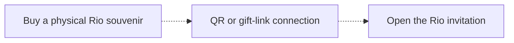
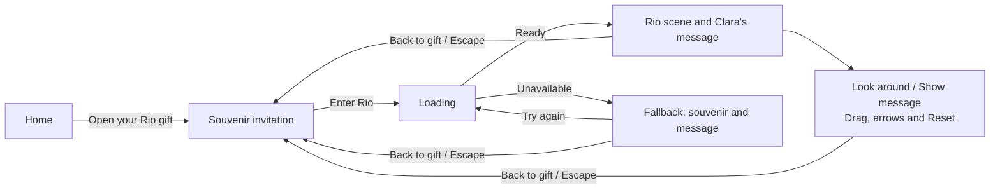

# GiftPortals V7 — user journey and publication status

Status reviewed October 1, 2026. The Rio experience is a local concept demo. The souvenir purchase and invitation from Clara are fictional backstory.

## Proposed real-world path — pending integration

The dotted path is proposed. Checkout, retailer integration, QR binding and a persistent personal Rio gift link are not implemented or externally verified. Opening the current fixed demo URL does not establish a purchase or a sent gift.

## Current working local path

The scene is a generated 2:1 image mapped onto a bounded 120-degree panorama window. It supports looking around; it is not freely walkable city geometry, a documentary reconstruction or a complete 360-degree capture. Opening it creates no provider job, collection entry or physical visit. Failed images are hidden; explicit Retry reloads them and the viewer. Back/Escape disposes the renderer and restores invitation focus and background scrolling.

## Separate available demo

The original Memory Studio remains accessible from Home and navigation. Its completed Tripo object and World Labs environment are separate from the Rio illustrations. It offers explicit Object/World/Story exploration, a session-only keepsake, memory train and atlas. These interactions do not establish persistent private gifting or physical travel.

## Verified status

| Area | Status and evidence |
| --- | --- |
| Rio local journey | Implemented; desktop/mobile and controlled failure/Retry evidence in `V7_RIO_VALIDATION.md` |
| Tests | Rechecked October 1: **125 passed, 0 failed**, in `outputs/giftportals-v7-rio/tests-recheck-2026-10-01.log` under the September 30 task output directory |
| Production build | October 1 frontend TypeScript + Vite build **PASS**, exit 0, 35.15 seconds; existing large lazy globe/environment bundle warnings remain. Evidence: `build-recheck-2026-10-01.log` |
| Public concept demo | Candidate for publication; actual HTTPS deployment and public readback remain unexecuted |
| Public-facing copy | About corrected and verified in the freshly compiled browser: artistic bounded Rio image, separate actual-provider Studio, session-only keepsakes, unavailable private creation/persistence/sharing, and pending private cloud validation |
| End-to-end private product | Incomplete: hosted authentication, storage/RLS, persistence, two-account integration and scheduler receipts remain pending |
| Physical purchase connection | Commerce, QR binding and personal Rio gift-link integration remain pending |
| Rio provider generation | No new Tripo or World Labs Rio job; the local scene and souvenir are generated raster illustrations |
| External delivery | No verified public deployment, V7 walkthrough recording or final submission receipt |

The 125 tests include fixture checks; they do not certify all devices, formal accessibility conformance or cloud operation. A local production bundle and screenshots are not external delivery receipts.
