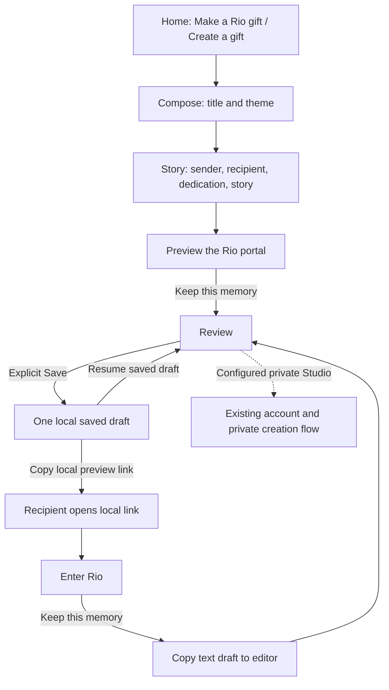

# V8 Rio gift creator journey

GiftPortals starts with the gift. Home’s **Make a Rio gift** and the header’s **Create a gift** open `#/compose`. The editor keeps the approved ivory and teal Rio identity, with a short editing sequence inspired by Partiful’s progressive composition.

## Compose and preview

1. **Gift:** enter a gift title and choose **Warm paper**, **Sunset**, or **Ocean**. These themes style the preview; the souvenir and Rio scene remain the fixed artistic assets.
2. **Story:** enter the sender, optional recipient, dedication, and story.
3. **Preview:** open the actual Rio panorama with the custom title, story, and sender. **Keep this memory** returns to the review stage; it does not save automatically.
4. **Review:** explicitly save the draft to this browser’s `localStorage`. After saving, copy the local preview link. **Resume saved draft** is an explicit action when returning to the editor.

On desktop, the preview stays sticky beside the editor. On mobile, a compact preview appears above the editor and the primary action remains fixed. Moving between steps scrolls the next heading into view.

## Local draft and recipient link

The copied link carries a text seed in its URL fragment. It includes the draft text and theme, with no uploaded media. The current link uses the loopback preview address and is usable on the same device while the preview server is running.

A recipient opening that link sees the personalized invitation, selects **Enter Rio**, and can select **Keep this memory** to copy the draft into the editor. Saving the resulting draft remains a separate, explicit action.

The browser stores one saved draft. Anyone using that browser profile may be able to resume it, so avoid sensitive personal information on a shared browser. Copying the preview link also exposes its included text to its holder.

## Account continuation and boundaries

Account setup is postponed until after composition. When private Studio is configured, it can offer continuation through the existing email and password flow: signup requires at least 12 password characters; login requires at least 8. The composer passes text only. Original photos, place selection, and media rights confirmation still require the user’s manual input in private creation.

The Rio portal is a bounded artistic image panorama, with look controls and a personal message. It is not freely walkable geometry. Themes do not request a new Rio asset or provider generation job. This journey demonstrates local composition and preview; it adds no SMS/OTP onboarding and establishes no new backend or public publishing integration.

All interface copy and project documentation remain in English. The composition sequence borrows progressive disclosure and immediate preview, while retaining GiftPortals’ own visual identity.
